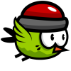
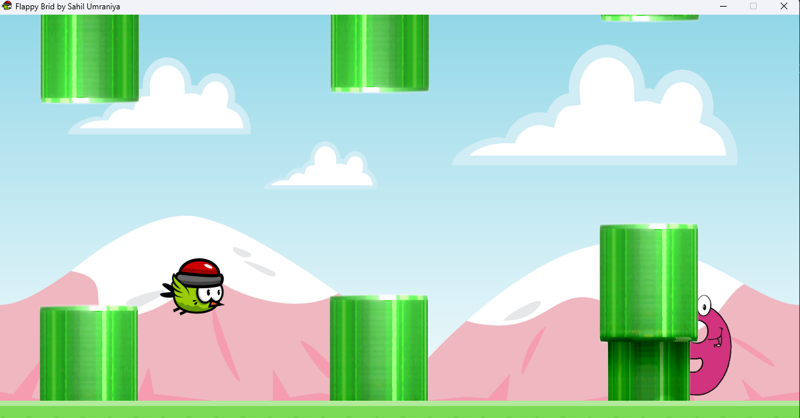

# Flappy Bird by Sahil Umraniya

Flappy Bird by Sahil Umraniya is a Python implementation of the classic Flappy Bird game, offering a nostalgic experience with a personal touch.

## Installation

To play the game, you can either run the Python script directly or download the executable file for your operating system from the [Releases](https://github.com/sahilumraniya/Flappy-Bird-Game/releases) page.

## Gameplay

- Use the spacebar to control the bird's altitude.
- Navigate the bird through gaps between pipes.
- Earn points by passing through pipes.
- Avoid collisions with pipes and the ground.
- Try to achieve the highest score possible!

## Features

- Simple one-touch controls.
- Dynamic pipe generation for endless gameplay.
- Score tracking and display.
- Game-over screen with final score.

## Getting Started

To run the game, make sure you have Python and Pygame installed on your system. Then, follow these steps:

1. Clone this repository to your local machine.
2. Navigate to the project directory.
3. Run the `Flappy_Bird.py` file with Python.

4. Enjoy playing Flappy Bird!

## Screenshots

## Credits

- **Sahil Umraniya** - Game development

## License

This project is licensed under the [MIT License](LICENSE).

---

Feel free to customize this README file with additional information or sections as needed. Happy gaming!
